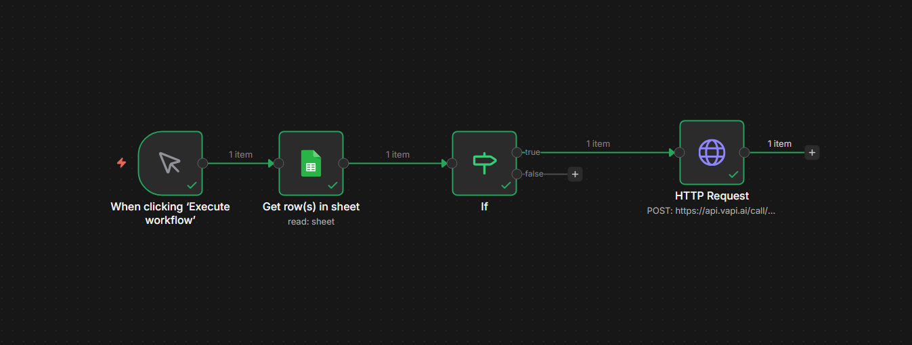

# 🤖 AI Voice Appointment Setter (Solar Industry)

This project features an end-to-end AI Voice Agent built for **Polaron Energy**. It qualifies homeowners for solar grants, handles complex objections, and live-syncs data to a CRM/Google Sheets.

## 📺 Live Demo
Click the image below to watch the full walkthrough of the agent in action:

*Click the image above to open the video in a new tab.*

## 🛠️ Technical Stack
- **Vapi AI:** Voice orchestration and STT/TTS.
- **n8n:** Workflow automation and logic routing.
- **Google Sheets API:** Real-time CRM updates.
- **Groq/Mistral:** LLM for lead qualification logic.

## 🚀 Key Features
- **Real-time Status Updates:** Automatically changes lead status to "Site Visit Booked" upon successful confirmation.
- **E.164 Validation:** Handles international phone formatting dynamically.
- **Natural Conversation:** Uses custom system prompts to ensure the agent sounds like a professional consultant, not a bot.
